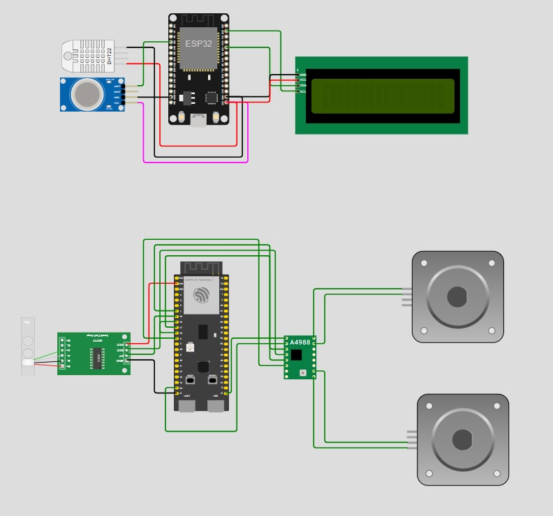

# pa-praktikum-iot-unmul-B6
Project Akhir Praktikum IoT - Smart Coop
# 🌍 Project Akhir Praktikum IoT - UNMUL 2026

Repositori ini berisi *source code* dan dokumentasi untuk pemenuhan Tugas Project Akhir Praktikum Internet of Things (IoT). Proyek ini berfokus pada otomatisasi manajemen kandang unggas melalui sistem monitoring lingkungan dan pemberian pakan cerdas.

---

## 👥 Anggota Kelompok

| Nama Lengkap | NIM | Peran |
| :--- | :--- | :--- |
| Achmad Zidan Al Baihaqi | 2309106084 | Ketua |
| Rifqi Ramadhan | 2309106007 | Anggota |
| Irvan Nurdiansyah | 2309106068 | Anggota |

---

## 📖 Judul Proyek
**Smart Coop: Sistem Monitoring dan Pemberian Pakan Otomatis Berbasis IoT**

---

## 📝 Deskripsi
**Smart Coop** adalah sebuah sistem berbasis Internet of Things (IoT) dengan arsitektur terdistribusi (*multi-node*) yang dirancang untuk mengotomatisasi manajemen kandang unggas. Sistem ini memantau kondisi lingkungan secara *real-time* dan memberikan pakan secara terjadwal.

- **Sistem Monitoring Lingkungan:**
  - **ESP32 DevKit V1** bertugas secara khusus membaca data dari sensor **DHT11** (Suhu & Kelembapan), membaca kualitas udara atau kadar gas melalui sensor **MQ-135** dan mengirimkannya secara kontinyu.
  - **ESP32 S3** bertindak sebagai kontroler utama penggerak pakan.
- **Manajemen Pakan Otomatis:**
  - Pemantauan ketersediaan sisa stok pakan dilakukan menggunakan sensor berat **Load Cell (dengan modul HX711)**.
  - Pembukaan dan penutupan katup penyalur pakan dikendalikan secara mekanis oleh **2 Motor DC** yang di-*drive* menggunakan modul **L298N**.
- **Platform IoT & Kontrol:**
  - Data diproses dan dieksekusi berdasarkan logika *threshold* maupun jadwal (jam, menit, dan volume/takaran) yang diatur dan disimpan dalam *database* **Firebase**.
  - Pengguna dapat memantau kondisi kandang secara lokal melalui **Layar LCD (I2C)**, maupun jarak jauh menggunakan aplikasi *mobile* berbasis **React Native** dan **Bot Telegram**. Komunikasi data *real-time* difasilitasi oleh protokol **MQTT**.

---

## ⚙️ Komponen yang Digunakan

1. 1x Board Mikrokontroler ESP32 S3 (Main Controller)
2. 1x Board Mikrokontroler ESP32 DevKit V1 (Sensor Monitoring)
3. 1x Sensor Suhu & Kelembapan (DHT11)
4. 1x Sensor Gas / Kualitas Udara (MQ-135)
5. 1x Sensor Berat (Load Cell) + Modul Amplifier HX711
6. 2x Motor DC
7. 1x Motor Driver (L298N)
8. 1x Layar LCD + Modul I2C
9. Kabel Jumper secukupnya
10. Platform / Software: Firebase, MQTT Broker, Telegram Bot, React

---

## 🛠️ Pembagian Tugas

| Nama Anggota | Deskripsi Tugas / Peran |
| :--- | :--- |
| **Achmad Zidan Al Baihaqi** | Mendesain antarmuka dan memprogram aplikasi *mobile* (React), serta mengatur arsitektur *database* di Firebase,  mengelola koneksi MQTT/Firebase pada aplikasi, Menulis kode program untuk mikrokontroler (ESP32 S3 & DevKit V1). |
| **Rifqi Ramadhan** | Menulis kode program untuk mikrokontroler (ESP32 S3 & DevKit V1), mengelola koneksi MQTT/Firebase pada esp32, memproses data sensor (MQ-135, Load Cell), dan logika aktuator L298N. |
| **Irvan Nurdiansyah** | Merakit komponen *hardware* (*wiring*), memastikan mekanika 2 Motor DC berjalan lancar, merakit layar LCD I2C, menyusun Bot Telegram, dan melakukan *testing*. |

---

## 🔌 Board Schematic

atas : ESP32 DOIT DEVKIT 1
BAWAH : ESP32 S3

| Komponen | Pin Komponen | Board Target | Pin Board |
| :--- | :--- | :--- | :--- |
| Sensor DHT11 | Data Out | ESP32 DevKit V1 | `4` |
| Sensor MQ-135 | Analog Out | ESP32 S3 | `34` |
| Load Cell (HX711) | DT / SCK | ESP32 S3 | `15 / 16` |
| Motor Driver L298N | IN1 / IN2 / IN3 / IN4 | ESP32 S3 | `17 / 18 / 7 / 8 ` |
| Modul I2C (LCD) | SDA / SCL | ESP32 S3 | `21 / 22` |
